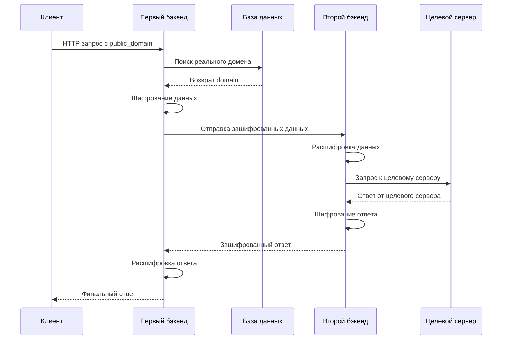

# 🔐 Двухуровневая прокси-система с шифрованием

> Безопасная и масштабируемая система проксирования запросов через распределенные бэкенды с end-to-end шифрованием

---

## 📋 Обзор проекта

**Двухуровневая прокси-система** — это архитектурное решение для безопасного перенаправления HTTP-запросов через промежуточные серверы с полным шифрованием данных между узлами.

### 🏗️ Архитектура

```
┌─────────────┐    ┌──────────────┐    ┌─────────────┐    ┌──────────────┐
│   Клиент    │───▶│ Первый       │───▶│ Второй      │───▶│  Целевой     │
│             │    │ бэкенд       │    │ бэкенд      │    │  сервер      │
│             │◀───│ (Маршрутизатор)│◀───│ (Прокси)    │◀───│             │
└─────────────┘    └──────────────┘    └─────────────┘    └──────────────┘
                           │                     
                           ▼                     
                   ┌──────────────┐             
                   │ PostgreSQL   │             
                   │ (Маппинг     │             
                   │  доменов)    │             
                   └──────────────┘             
```

---

## 🎯 Назначение системы

### **Основные цели:**

- **🛡️ Безопасность** — Скрытие реальных доменов и шифрование трафика
- **🌐 Анонимность** — Проксирование запросов через промежуточные серверы  
- **⚡ Масштабируемость** — Распределение нагрузки между независимыми узлами
- **🔧 Гибкость** — Динамическое управление доменами через API

### **Применение:**
- Обход географических блокировок
- Защита от DDoS-атак через распределение
- Мониторинг и аналитика трафика
- Кеширование и оптимизация запросов

---

## 🚀 Быстрый старт

### 1️⃣ Подготовка окружения

```bash
# Клонирование репозитория
git clone <repository-url>
cd proxy-system

# Создание .env файла
cp .env.example .env
```

### 2️⃣ Конфигурация `.env`

```bash
# 🔑 Шифрование (ОБЯЗАТЕЛЬНО 32 символа!)
CRYPTO_KEY=your_super_secret_32_char_key_here

# 🗄️ База данных PostgreSQL
POSTGRES_USER=proxy_user
POSTGRES_PASSWORD=secure_password_123
POSTGRES_HOST=db
POSTGRES_PORT=5432
POSTGRES_DB=proxy_domains

# 🌐 IP адреса серверов
FIRST_BACKEND=192.168.1.100:8000
SECOND_BACKEND=192.168.1.200:8100
```

### 3️⃣ Запуск первого бэкенда

```bash
cd first_backend
docker-compose up --build -d

# Проверка статуса
curl http://localhost:8000/api/ping
# Ответ: "pong"
```

### 4️⃣ Запуск второго бэкенда

```bash
cd second_backend
docker-compose up --build -d

# Проверка статуса  
curl http://localhost:8100/api/ping
# Ответ: "pong"
```

---

## 🔧 Управление доменами

### Добавление нового домена

```bash
curl -X POST "http://your-first-backend/api/add/domain" \
  -H "Content-Type: application/json" \
  -d '{
    "public_domain": "safe-alias",
    "domain": "https://target-website.com"
  }'
```

**Пример:**
```json
{
  "public_domain": "news-portal",
  "domain": "https://bbc.com"
}
```

### Проверка домена

```bash
curl -X POST "http://your-first-backend/api/check_domain" \
  -H "Content-Type: application/json" \
  -d '{
    "public_domain": "news-portal",
    "path": "/world",
    "request_type": "GET",
    "body": {},
    "headers": {},
    "cookies": {}
  }'
```

---

## 🔄 Поток данных

### Детальная схема обработки запроса:



---

## 📚 API Документация

### 🔗 Эндпоинты первого бэкенда

| Метод | Путь | Описание |
|-------|------|----------|
| `POST` | `/api/add/domain` | Добавление нового домена |
| `POST` | `/api/check_domain` | Проверка и перенаправление |
| `GET` | `/api/ping` | Проверка работоспособности |
| `GET` | `/api/docs` | Swagger документация |

### 🔗 Эндпоинты второго бэкенда

| Метод | Путь | Описание |
|-------|------|----------|
| `POST` | `/api/capture` | Прием зашифрованных данных |
| `POST` | `/api/redirect/get` | Выполнение GET запросов |
| `GET` | `/api/ping` | Проверка работоспособности |

---

## 🧪 Тестирование

### Автоматические тесты

```bash
# Переход в папку тестов
cd tests

# Запуск тестового набора
python test.py
```

### Ручное тестирование

```bash
# 1. Добавление тестового домена
curl -X POST "http://localhost:8000/api/add/domain" \
  -H "Content-Type: application/json" \
  -d '{"public_domain": "test-site", "domain": "https://httpbin.org"}'

# 2. Тестовый запрос через прокси
curl -X POST "http://localhost:8000/api/check_domain" \
  -H "Content-Type: application/json" \
  -d '{
    "public_domain": "test-site",
    "path": "/get",
    "request_type": "GET",
    "body": {},
    "headers": {},
    "cookies": {}
  }'
```

---

## 🛠️ Технологический стек

### **Backend Framework**
- **FastAPI** — Современный веб-фреймворк для Python
- **Uvicorn** — ASGI сервер для запуска приложений

### **База данных** 
- **PostgreSQL 15** — Реляционная база данных
- **SQLAlchemy** — ORM для работы с БД
- **AsyncPG** — Асинхронный драйвер PostgreSQL

### **Инфраструктура**
- **Docker & Docker Compose** — Контейнеризация
- **Caddy** — Веб-сервер и обратный прокси

### **Безопасность**
- **Cryptocode** — Симметричное шифрование
- **Environment Variables** — Управление конфигурацией

### **HTTP клиенты**
- **aiohttp** — Асинхронные HTTP запросы
- **requests** — Синхронные HTTP запросы

---

## ⚙️ Конфигурация компонентов

### Docker Compose (первый бэкенд)

```yaml
version: "3.9"
services:
  first_backend:
    build:
      dockerfile: ./Dockerfile
    container_name: first_backend
    ports:
      - "8000:8000"
    depends_on:
      - db
    
  first_caddy:
    image: caddy:2.7.6
    ports:
      - "80:80"
    volumes:
      - "./docker/caddy:/etc/caddy"
      
  db:
    image: postgres:15.4-alpine
    container_name: db
    restart: unless-stopped
```

### Caddy конфигурация

```caddyfile
your-server-ip:80 {
    reverse_proxy first_backend:8000
}
```

---

## 🔒 Безопасность

### Шифрование данных
- **Алгоритм:** Симметричное шифрование через cryptocode
- **Ключ:** 32-символьная строка в переменной `CRYPTO_KEY`
- **Область:** Все данные между первым и вторым бэкендом

### Рекомендации по безопасности

✅ **Обязательно:**
- Используйте сложный 32-символьный ключ шифрования
- Регулярно ротируйте ключи шифрования  
- Запускайте бэкенды на разных серверах
- Используйте HTTPS для внешних подключений

⚠️ **Избегайте:**
- Хранения ключей шифрования в коде
- Запуска обоих бэкендов на одном сервере
- Использования слабых паролей для базы данных

---

## 📊 Мониторинг и логирование

### Структура логов

```json
{
  "timestamp": "2024-07-07T12:00:00.000Z",
  "level": "INFO", 
  "message": "Domain added successfully",
  "source": "service.py:add_domain:25"
}
```

### Проверка статуса сервисов

```bash
# Статус контейнеров
docker-compose ps

# Логи первого бэкенда
docker-compose logs first_backend

# Логи второго бэкенда  
docker-compose logs second_backend

# Логи базы данных
docker-compose logs db
```

---

## 🚨 Устранение неполадок

### Частые проблемы

**🔴 Ошибка подключения к базе данных**
```bash
# Проверка статуса PostgreSQL
docker-compose exec db psql -U $POSTGRES_USER -d $POSTGRES_DB -c "\l"
```

**🔴 Ошибки шифрования**
```bash
# Проверка длины ключа (должно быть 32)
echo ${#CRYPTO_KEY}
```

**🔴 Сетевые ошибки между бэкендами**
```bash
# Проверка доступности второго бэкенда
curl http://$SECOND_BACKEND/api/ping
```

### Полезные команды

```bash
# Перезапуск системы
docker-compose down && docker-compose up --build -d

# Очистка логов  
docker-compose logs --tail=0 first_backend

# Подключение к контейнеру
docker-compose exec first_backend sh
```

---

## 📈 Масштабирование

### Горизонтальное масштабирование

1. **Множественные первые бэкенды** за load balancer
2. **Несколько вторых бэкендов** с round-robin балансировкой
3. **Кластер PostgreSQL** для высокой доступности

### Вертикальное масштабирование

```yaml
# docker-compose.yml
services:
  first_backend:
    deploy:
      resources:
        limits:
          memory: 1G
          cpus: '0.5'
```

---

## 🤝 Разработка

### Структура проекта

```
proxy-system/
├── first_backend/
│   ├── src/
│   │   ├── api/          # API эндпоинты
│   │   ├── db/           # Модели базы данных  
│   │   └── utils/        # Утилиты (шифрование, клиенты)
│   ├── docker/
│   └── requirements.txt
├── second_backend/
│   ├── src/
│   │   ├── api/          # API эндпоинты
│   │   └── utils/        # Утилиты
│   └── requirements.txt
└── tests/
    └── test.py
```

### Локальная разработка

```bash
# Установка зависимостей
pip install -r first_backend/requirements.txt

# Запуск в режиме разработки
cd first_backend/src
uvicorn main:app --reload --host 0.0.0.0 --port 8000
```

---

## 📝 Лицензия

Этот проект предназначен для образовательных и исследовательских целей. Используйте ответственно и в соответствии с местным законодательством.

---

*Документация обновлена: July 2025*
